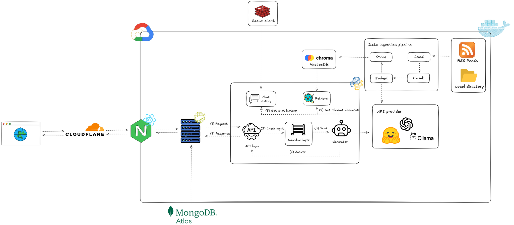

# 🥦 NutriTrack — Giải pháp phần mềm theo dõi dinh dưỡng thông minh

[](./LICENSE)
[]()
[]()
[]()
[]()
[]()
[]()

## **NutriTrack** là hệ thống hỗ trợ **theo dõi dinh dưỡng và lối sống** toàn diện, giúp người dùng dễ dàng quản lý chế độ ăn uống, cải thiện sức khỏe, và duy trì thói quen lành mạnh trong cuộc sống hiện đại.

## 🎯 Mục tiêu của dự án

- 🍽️ **Theo dõi chế độ ăn uống:**  
  Cung cấp công cụ giúp người dùng ghi lại **lượng calo**, **dưỡng chất**, và **thói quen ăn uống hàng ngày**, hỗ trợ kiểm soát cân nặng và sức khỏe.

- 🗃️ **API ổn định và mở rộng:**  
  Xây dựng **API backend đáng tin cậy** cho phép lưu trữ và truy xuất **món ăn**, **nguyên liệu**, và **thông tin dinh dưỡng** một cách linh hoạt.

- 📸 **Nhận diện món ăn bằng AI:**  
  Hỗ trợ **người dùng tải lên hình ảnh món ăn**, hệ thống sẽ **phân tích và nhận diện** loại thực phẩm, **ước tính giá trị dinh dưỡng**, và **lượng calo tương ứng**.

- 🤖 **Phân tích & Gợi ý thông minh (AI Module):**  
  Ứng dụng **trí tuệ nhân tạo (AI)** để **phân tích bữa ăn hàng ngày**, đánh giá **mức độ cân bằng dinh dưỡng**, và **đưa ra lời khuyên cá nhân hóa**.

- 🧠 **Chuyên gia dinh dưỡng ảo:**  
  Tích hợp **AI Chatbot** — “**Chuyên gia dinh dưỡng cá nhân**” có khả năng tư vấn, giải đáp thắc mắc và gợi ý thực đơn phù hợp với mục tiêu sức khỏe của từng người dùng.

---

## 🛠️ Công nghệ sử dụng

| Thành phần        | Công nghệ                           | Chức năng                                                                                          | Ưu điểm                                                            |
| ----------------- | ----------------------------------- | -------------------------------------------------------------------------------------------------- | ------------------------------------------------------------------ |
| **Frontend**      | 🧩 React + TypeScript + TailwindCSS | Xây dựng giao diện người dùng thân thiện, hiển thị dữ liệu dinh dưỡng và tương tác với AI Chatbot. | Hiệu năng cao ⚡, dễ bảo trì 🛠️, UI hiện đại và responsive 📱.     |
| **Backend**       | ☕ Java Spring Boot                 | Xử lý logic nghiệp vụ, quản lý người dùng, món ăn, và kết nối với AI module.                       | Mạnh mẽ 💪, dễ mở rộng, hỗ trợ RESTful API chuẩn hóa 🌐.           |
| **Cơ sở dữ liệu** | 🍃 MongoDB                          | Lưu trữ thông tin món ăn, nguyên liệu, lịch sử ăn uống và phản hồi từ AI.                          | Linh hoạt trong cấu trúc dữ liệu, hiệu suất cao cho truy vấn JSON. |
| **AI Module**     | 🧠 Python Flask + OpenAI API        | Phân tích dinh dưỡng từ dữ liệu người dùng và sinh gợi ý cá nhân hóa.                              | Dễ tích hợp 🤝, sử dụng mô hình AI tiên tiến 🤖.                   |
| **Triển khai**    | 🐳 Docker + Nginx                   | Đóng gói và triển khai toàn bộ hệ thống trên môi trường container.                                 | Tính di động cao 🚀, dễ mở rộng và triển khai CI/CD 🧱.            |

---

## 💡 Tính năng nổi bật

✅ **Theo dõi & thống kê bữa ăn hàng ngày**  
✅ **Nhận diện món ăn từ hình ảnh (AI Vision)**  
✅ **Phân tích & đánh giá dinh dưỡng tự động**  
✅ **Chatbot tư vấn dinh dưỡng theo thời gian thực**  
✅ **RESTful API lưu trữ & quản lý dữ liệu món ăn**  
✅ **Giao diện hiện đại, thân thiện và responsive**

> 🧩 _NutriTrack kết hợp sức mạnh AI & dữ liệu dinh dưỡng giúp người dùng hiểu rõ hơn về thực phẩm họ tiêu thụ – chỉ với một bức ảnh._

---

## 🏗️ Kiến trúc hệ thống

## 

## 🧩 Yêu cầu (Prerequisites)

Để chạy dự án **NutriTrack**, hãy đảm bảo rằng bạn đã cài đặt các công cụ sau trên máy:

- 🧰 **Git** – để clone và quản lý mã nguồn.
- 🧩 **Node.js (LTS ≥ 16)** – chạy ứng dụng frontend (React + TypeScript).
- 📦 **npm hoặc yarn** – quản lý và cài đặt thư viện frontend.
- ☕ **Java JDK ≥ 21** – chạy backend (Spring Boot).
- 🏗️ **Maven** – dùng để build và quản lý dependency của backend.
- 🐍 **Python ≥ 3.13** – chạy mô-đun AI (Flask + OpenAI API).
- 📦 **pip** – cài đặt các gói cần thiết cho mô-đun AI.
- 🐳 **Docker & docker-compose** _(tùy chọn)_ – dùng để khởi chạy nhanh toàn bộ hệ thống trong môi trường container.

---

## Hướng dẫn cài đặt & chạy nhanh (mẫu)

1. Clone repository

```bash
git clone https://github.com/Fat1512/NutriTrack.git
cd NutriTrack
```

## ⚙️ 2. Backend (Java — Spring Boot)

### 🧾 Cấu hình môi trường

Trước khi chạy backend, hãy thiết lập các **biến môi trường** cần thiết:

```bash

MONGO_URL=your-mongodb-url
AUTH_SECRET_KEY=your-secret-key
AI_SERVER_URL=http://localhost:5000/api
```

```bash
cd eatwise-server
./mvnw clean package
./mvnw spring-boot:run
java -jar target/your-app-name.jar
```

## ⚛️ 3. Frontend (TypeScript — React + Vite)

### 🧾 Cấu hình môi trường

Trước khi khởi chạy frontend, hãy tạo tệp `.env` trong thư mục `eatwise-frontend` với nội dung sau:

```bash
VITE_BASE_URL=http://localhost:8080/eatwise-service/api/v1
VITE_AI_URL=http://localhost:5000/api/
```

```bash
cd eatwise-frontend
yarn install
yarn dev
yarn build
```

---

## 4. AI (Python - Flask)

Trước khi khởi chạy AI, hãy tạo tệp `.env` trong thư mục `AI` với nội dung sau:

```bash
LLM_PROVIDER=openai o
OPENAI_MODEL=gpt-4o-mini or OLLAMA_MODEL=llava-phi3:3.8b
OPENAI_API_KEY=your-api-key
OLLAMA_HOST=http://localhost:11434 when using ollama
EMBEDDING_PROVIDER=sentence_transformer
EMBEDDING_MODEL_NAME=bkai-foundation-models/vietnamese-bi-encoder
WATCHER_LOCAL_PATH=./storage
WATCHER_RSS_URLS=https://suckhoedoisong.vn/dinh-duong.rss or website support for rss
WATCHER_RSS_INTERVAL=60
RSS_WATCHER_ENABLED=true
RSS_MAX_AGE_DAYS=1
RSS_MAX_BACKFILL_PAGES=1
REDIS_HOST=your-redis-host
REDIS_PORT=your-redis-port
REDIS_USERNAME=your-redis-username
REDIS_PASSWORD=your-redis-password
```

```bash
cd AI
python -m venv venv
source venv/bin/activate   # macOS / Linux
venv\Scripts\activate      # Windows

pip install -r requirements.txt
python main.py
```

---

5. Chạy toàn bộ bằng Docker

```bash
docker-compose up --build
```

## ⚙️ Cấu Hình Ports

| 🚦 **Dịch Vụ**                 | 💻 **Cổng (Development)** | 📝 **Mô Tả**                                                                           |
| :----------------------------- | :-----------------------: | :------------------------------------------------------------------------------------- |
| 💻 **Frontend (React / Vite)** |          `5173`           | Giao diện người dùng chính của **NutriTrack**                                          |
| ⚙️ **Backend (Spring Boot)**   |          `8080`           | API trung tâm xử lý dữ liệu và nghiệp vụ                                               |
| 🧠 **AI Service (Flask)**      |          `5000`           | Dịch vụ **AI/LLM** phân tích dinh dưỡng và nhận diện thực phẩm                         |
| 🍃 **MongoDB**                 |          `27017`          | Hệ quản trị **cơ sở dữ liệu NoSQL** lưu trữ thông tin người dùng và nhật ký dinh dưỡng |

---

## 🔌 Các Endpoint chính

### Endpoint Backend

- **Base URL (dev):** `http://localhost:8080/eatwise-service/api/v1`

| Method | Endpoint                    | Mô tả                                         |
| ------ | --------------------------- | --------------------------------------------- |
| `GET`  | `/foods`                    | Lấy danh sách toàn bộ các món ăn              |
| `GET`  | `/ingredients`              | Lấy danh sách toàn bộ các nguyên liệu         |
| `GET`  | `/routine/pickedDate`       | Lấy lịch trình ăn uống theo ngày              |
| `GET`  | `/routine/statics`          | Thống kê dinh dưỡng của người dùng theo tháng |
| `GET`  | `/routine/consume-nutrient` | Lấy thông tin các chất người dùng đã tiêu thụ |
| `POST` | `/routine/food`             | Thêm món ăn vào lịch ăn hàng ngày             |

---

### Endpoint AI Service

| Method   | Endpoint               | Mô tả                                                                                                                                                                                                                                                         |
| -------- | ---------------------- | ------------------------------------------------------------------------------------------------------------------------------------------------------------------------------------------------------------------------------------------------------------- |
| `POST`   | `/api/analyze`         | Phân tích một hoặc nhiều hình ảnh món ăn. <br>**Input:** `multipart/form-data` chứa file hoặc nhiều file dưới key `images`. <br>**Response:** JSON chứa kết quả phân tích từ `FoodPipeline`. <br>**Note:** File tạm thời được tạo và tự động xóa trên server. |
| `POST`   | `/api/analyze-routine` | Phân tích thói quen ăn uống và trạng thái dinh dưỡng của người dùng. <br>**Input:** JSON chứa các key `routine` và `userStatus`. <br>**Response:** JSON chứa kết quả phân tích từ `FoodPipeline`.                                                             |
| `POST`   | `/api/rag/upload`      | Upload file. File sẽ được lưu vào `WATCH_DIR` và được xử lý bởi `LocalFolderWatcher`.                                                                                                                                                                         |
| `POST`   | `/api/rag/chat`        | Body: `{ "query": "Câu hỏi của bạn" }` <br>Trả về luồng phản hồi RAG dựa trên các tài liệu đã ingest.                                                                                                                                                         |
| `GET`    | `/api/rag/documents`   | Liệt kê tất cả các tài liệu duy nhất hiện có trong vector store.                                                                                                                                                                                              |
| `DELETE` | `/api/rag/document`    | Body: `{ "filename": "ten_file_can_xoa.pdf" }` <br>Xóa tài liệu khỏi vector store.                                                                                                                                                                            |

## ⚖️ Quy Tắc Ứng Xử

Dự án này tuân theo **Bộ Quy Tắc Ứng Xử dành cho cộng đồng**.  
Vui lòng xem chi tiết trong [CODE_OF_CONDUCT.md](./CODE_OF_CONDUCT.md) để biết thêm về các quy tắc và hành vi được chấp nhận.

---

## 🧾 Giấy Phép

Dự án này được phân phối theo **Giấy phép Apache License 2.0**.  
Bạn có thể xem chi tiết trong [file LICENSE](./LICENSE) của repository.

---

## 📞 Liên Hệ

| 📬 **Phương Thức** | 📱 **Chi Tiết**                                   |
| ------------------ | ------------------------------------------------- |
| **Email**          | [fcletan12@gmail.com](mailto:fcletan12@gmail.com) |
| **Hotline**        | +84 914 132 508                                   |

---

## 🪲 Báo Cáo Lỗi & Góp Ý

### 📝 Issues

Nếu bạn phát hiện lỗi hoặc có đề xuất tính năng mới, vui lòng tạo **Issue** tại:  
👉 [GitHub Issues](https://github.com/Fat1512/NutriTrack/issues)

Chúng tôi rất hoan nghênh mọi đóng góp và phản hồi từ cộng đồng 💡.

# Authors

- tanle9t2 — https://github.com/tanle9t2
- Fat1512 — https://github.com/Fat1512
- DatLe328 — https://github.com/DatLe328
